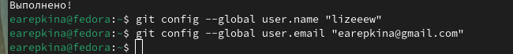

---
## Front matter
lang: ru-RU
title: Лабораторная работа №2
subtitle: Операционные системы
author:
  - Репкина Е. А.
institute:
  - Российский университет дружбы народов, Москва, Россия
date: 4 марта 2025

## i18n babel
babel-lang: russian
babel-otherlangs: english

## Formatting pdf
toc: false
toc-title: Содержание
slide_level: 2
aspectratio: 169
section-titles: true
theme: metropolis
header-includes:
 - \metroset{progressbar=frametitle,sectionpage=progressbar,numbering=fraction}
---

## Цель работы

Цель данной лабораторной работы -- изучение идеологии и применения средств контроля версий, освоение умения по работе с git.

## Задание

1. Создать базовую конфигурацию для работы с git
2. Создать ключ SSH
3. Создать ключ GPG
4. Настроить подписи Git
5. Заргеистрироваться на GitHub
6. Создать локальный каталог для выполнения заданий по предмету.

## Выполнение лабораторной работы. Установка ПО.
Устанавливаю git(рис. [-@fig:001])

{#fig:001 width=70%}

Устанавливаю gh (рис. [-@fig:002])

{#fig:002 width=70%}

## Выполнение лабораторной работы. Базовая настройка git

Задаю имя и email владельца репозитория(рис. [-@fig:003])

{#fig:003 width=70%}

## Выполнение лабораторной работы. Базовая настройка git

Настраиваю utf-8 в выводе сообщений git,верификацию и подписание коммитов git,задаю имя начальной ветки (рис. [-@fig:004])

{#fig:004 width=70%}

## Выполнение лабораторной работы. Создание ключа SSH

Создаю ssh ключ (рис. [-@fig:005])

{#fig:005 width=70%}

## Выполнение лабораторной работы. Создание ключа GPG

Создаю ключи pgp (рис. [-@fig:006])

{#fig:006 width=70%}

копирую сгенерированный PGP ключ в буфер обмена  (рис. [-@fig:007])

{#fig:007 width=70%}

Настраиваю gh (рис. [-@fig:008])

{#fig:008 width=70%}
 
## Выполнение лабораторной работы. Регистрация на Github

Авторизовываюсь в gh (рис. [-@fig:009])

{#fig:009 width=70%}

## Выполнение лабораторной работы. Создание репозитория курса на основе шаблона

Создаю репозиторий курса на основе шаблона (рис. [-@fig:010])

{#fig:010 width=70%}

## Выполнение лабораторной работы. Создание репозитория курса на основе шаблона

Перехожу в каталог курса, удаляю лишние файлы и создаю необходимые каталоги (рис. [-@fig:011])

{#fig:011 width=70%}

## Выполнение лабораторной работы. Создание репозитория курса на основе шаблона

Отправляю файлы на сервер (рис. [-@fig:012])

{#fig:012 width=70%}

## Выводы

При выполнении данной лабораторной работы я изучила идеологию и применение средств контроля версий, освоила умение по работе с git.

:::

