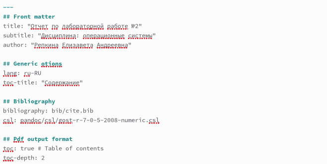
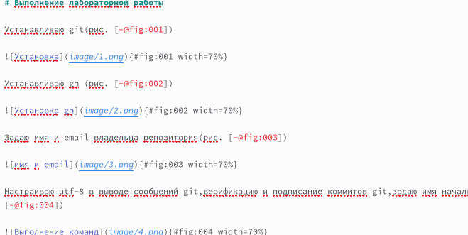
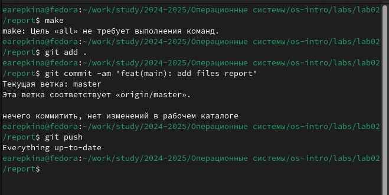
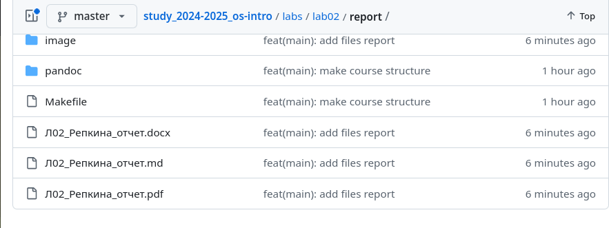

---
## Front matter
lang: ru-RU
title: Лабораторная работа №3
subtitle: Операционные системы
author:
  - Репкина Е. А.
institute:
  - Российский университет дружбы народов, Москва, Россия
date: 4 марта 2025

## i18n babel
babel-lang: russian
babel-otherlangs: english

## Formatting pdf
toc: false
toc-title: Содержание
slide_level: 2
aspectratio: 169
section-titles: true
theme: metropolis
header-includes:
 - \metroset{progressbar=frametitle,sectionpage=progressbar,numbering=fraction}
---

##Цель работы

Научиться оформлять отчёты с помощью легковесного языка разметки Markdown

##Задание

 -Сделайте отчёт по предыдущей лабораторной работе в формате Markdown.
– В качестве отчёта просьба предоставить отчёты в 3 форматах: pdf, docx и md (в архиве,
поскольку он должен содержать скриншоты, Makefile и т.д.)

## Выполнение лабораторной работы. Работа с шаблоном

Открываю шаблон и меняю указанные данные (рис. [-@fig:001])

{#fig:001 width=70%}

Заканчиваю создание отчета (рис. [-@fig:002])

## Выполнение лабораторной работы. Работа с шаблоном

{#fig:002 width=70%} 

## Выполнение лабораторной работы. Работа в терминале

Компилирую файлы(рис. [-@fig:003])

{#fig:003 width=70%}

## Выполнение лабораторной работы. Завершение лабороторной работы

Отчет на gh (рис. [-@fig:004])

{#fig:004 width=70%}
