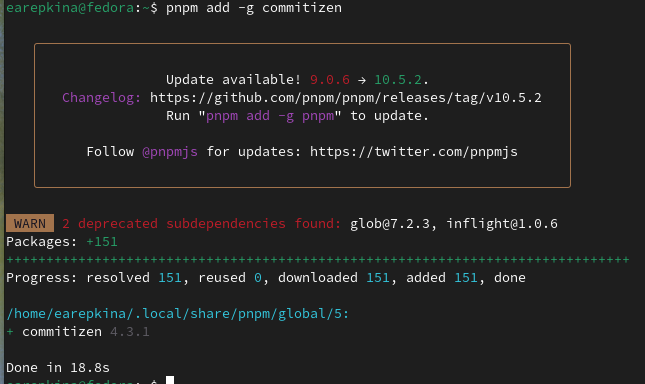
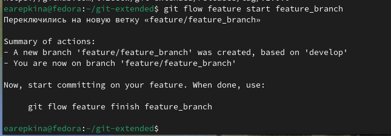

---
## Front matter
lang: ru-RU
title: Лабораторная работа №4
subtitle: Операционные системы
author:
  - Репкина Е. А.
institute:
  - Российский университет дружбы народов, Москва, Россия
date: 4 марта 2025

## i18n babel
babel-lang: russian
babel-otherlangs: english

## Formatting pdf
toc: false
toc-title: Содержание
slide_level: 2
aspectratio: 169
section-titles: true
theme: metropolis
header-includes:
 - \metroset{progressbar=frametitle,sectionpage=progressbar,numbering=fraction}
---

## Докладчик

  * Репкина Елизавета Андреевна
  *  НКАбд-04-24
  * Российский университет дружбы народов
  * https://github.com/lizeeew

## Цель работы

Получение навыков правильной работы с репозиториями git.

## Задание

    -Выполнить работу для тестового репозитория.
    -Преобразовать рабочий репозиторий в репозиторий с git-flow и conventional commits.

## Выполнение лабораторной работы.Установка git-flow

Устанавливаю gitflow (рис. [-@fig:001])

{#fig:001 width=70%}

## Выполнение лабораторной работы.Установка Node.js

Устанавливаю Node.js (рис. [-@fig:002])

{#fig:002 width=70%}

## Выполнение лабораторной работы.Установка Node.js

Продолжаю установку  (рис. [-@fig:003])

{#fig:003 width=70%}

## Выполнение лабораторной работы.Настройка Node.js

Запускаю pnpm setup (рис. [-@fig:004])

{#fig:004 width=70%}

## Выполнение лабораторной работы.Общепринятые коммиты commitizen

Данная программа используется для помощи в форматировании коммитов.рис. [-@fig:005])

{#fig:005 width=70%}

## Выполнение лабораторной работы.Общепринятые коммиты.standard-changelog

Данная программа используется для помощи в создании логов (рис. [-@fig:006])

{#fig:006 width=70%}

## Выполнение лабораторной работы.Практический сценарий использования git

Создаю репозиторий, делаю коммит и выкладываю на github (рис. [-@fig:007])

{#fig:007 width=70%}

## Выполнение лабораторной работы.Создание репозитория git

Редактирую параметры пакета  (рис. [-@fig:008])

{#fig:008 width=70%}

## Выполнение лабораторной работы.Конфигурация общепринятых коммитов

Добавляю новые файлы, выполняю коммит и отправляю на github (рис. [-@fig:009])

{#fig:009 width=70%}

## Выполнение лабораторной работы.Конфигурация git-flow

Инициализирую git-flow (рис. [-@fig:010])

{#fig:010 width=70%}

## Выполнение лабораторной работы.Конфигурация git-flow

Загружаю весь репозиторий в хранилище (рис. [-@fig:011])

{#fig:011 width=70%}

## Выполнение лабораторной работы.Конфигурация git-flow

Создаю релиз с версией 1.0.0 (рис. [-@fig:012])

{#fig:012 width=70%}

## Выполнение лабораторной работы.Конфигурация git-flow

Создаю журнал изменений(рис. [-@fig:013])

{#fig:013 width=70%}

## Выполнение лабораторной работы.Конфигурация git-flow

Добавляю журнал изменений в индекс (рис. [-@fig:014])

{#fig:014 width=70%}

## Выполнение лабораторной работы.Конфигурация git-flow

Заливаю релизную ветку в основную ветку (рис. [-@fig:015])

{#fig:015 width=70%}

## Выполнение лабораторной работы.Конфигурация git-flow

отправляю данные на github (рис. [-@fig:016])

{#fig:016 width=70%}

## Выполнение лабораторной работы.Работа с репозиторием git

Создаю ветку для новой функциональности  (рис. [-@fig:017])

{#fig:017 width=70%}

## Выполнение лабораторной работы.Работа с репозиторием git

Далее, продолжаю работу c git как обычно.
По окончании разработки новой функциональности следующим шагом объединяю ветку feature_branch c develop (рис. [-@fig:018])

{#fig:018 width=70%}

## Выполнение лабораторной работы.Работа с репозиторием git

Создание релиза с версией 1.2.3 (рис. [-@fig:019])

{#fig:019 width=70%}

## Выполнение лабораторной работы.Работа с репозиторием git

Обновляю номер версии в файле package.json. Устанавливаю её в 1.2.3.
Создаю журнал изменений (рис. [-@fig:020])

{#fig:020 width=70%}

## Выполнение лабораторной работы.Работа с репозиторием git

Добавляю журнал изменений в индекс и заливаю релизную ветку в основную ветку(рис. [-@fig:021])

{#fig:021 width=70%}

## Выполнение лабораторной работы.Работа с репозиторием git

Отправляю данные на github (рис. [-@fig:022])

{#fig:022 width=70%}
 
## Выполнение лабораторной работы.Работа с репозиторием git

Создаю релиз на github с комментарием из журнала изменений  (рис. [-@fig:023])

{#fig:023 width=70%}

## Выводы

В ходе выполнения работы я получила навыки правильной работы с репозиториями git.

