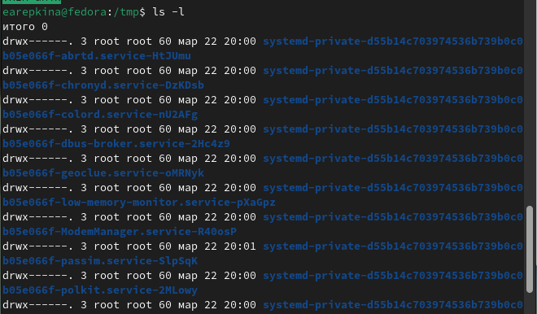
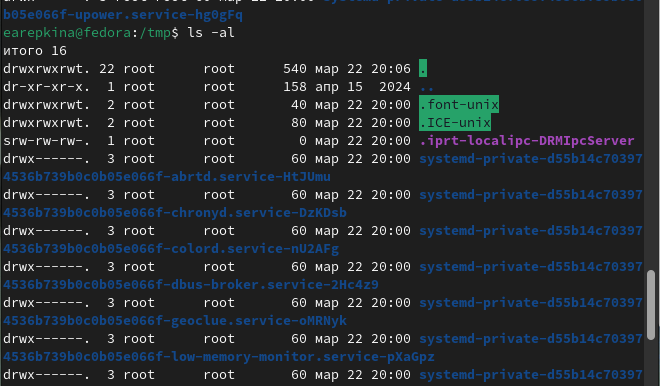

---
## Front matter
title: "Отчет по лабораторной работе №6"
subtitle: "Дисциплина: операционные системы"
author: "Репкина Елизавета Андреевна"

## Generic otions
lang: ru-RU
toc-title: "Содержание"

## Bibliography
bibliography: bib/cite.bib
csl: pandoc/csl/gost-r-7-0-5-2008-numeric.csl

## Pdf output format
toc: true # Table of contents
toc-depth: 2
lof: true # List of figures
lot: true # List of tables
fontsize: 12pt
linestretch: 1.5
papersize: a4
documentclass: scrreprt
## I18n polyglossia
polyglossia-lang:
  name: russian
  options:
	- spelling=modern
	- babelshorthands=true
polyglossia-otherlangs:
  name: english
## I18n babel
babel-lang: russian
babel-otherlangs: english
## Fonts
mainfont: IBM Plex Serif
romanfont: IBM Plex Serif
sansfont: IBM Plex Sans
monofont: IBM Plex Mono
mathfont: STIX Two Math
mainfontoptions: Ligatures=Common,Ligatures=TeX,Scale=0.94
romanfontoptions: Ligatures=Common,Ligatures=TeX,Scale=0.94
sansfontoptions: Ligatures=Common,Ligatures=TeX,Scale=MatchLowercase,Scale=0.94
monofontoptions: Scale=MatchLowercase,Scale=0.94,FakeStretch=0.9
mathfontoptions:
## Biblatex
biblatex: true
biblio-style: "gost-numeric"
biblatexoptions:
  - parentracker=true
  - backend=biber
  - hyperref=auto
  - language=auto
  - autolang=other*
  - citestyle=gost-numeric
## Pandoc-crossref LaTeX customization
figureTitle: "Рис."
tableTitle: "Таблица"
listingTitle: "Листинг"
lofTitle: "Список иллюстраций"
lotTitle: "Список таблиц"
lolTitle: "Листинги"
## Misc options
indent: true
header-includes:
  - \usepackage{indentfirst}
  - \usepackage{float} # keep figures where there are in the text
  - \floatplacement{figure}{H} # keep figures where there are in the text
---

# Цель работы

Приобретение практических навыков взаимодействия пользователя с системой посредством командной строки.

# Задание

# Теоретическое введение

В операционной системе типа Linux взаимодействие пользователя с системой обычно
осуществляется с помощью командной строки посредством построчного ввода команд. При этом обычно используется командные интерпретаторы языка shell: /bin/sh;
/bin/csh; /bin/ksh.
Формат команды. Командой в операционной системе называется записанный по
специальным правилам текст (возможно с аргументами), представляющий собой указание на выполнение какой-либо функций (или действий) в операционной системе.
Обычно первым словом идёт имя команды, остальной текст — аргументы или опции,
конкретизирующие действие.
Общий формат команд можно представить следующим образом:
<имя_команды><разделитель><аргументы>
Команда man. Команда man используется для просмотра (оперативная помощь) в диалоговом режиме руководства (manual) по основным командам операционной системы
типа Linux.
Формат команды:
man <команда>
Пример (вывод информации о команде man):
1 man man
Для управления просмотром результата выполнения команды man можно использовать
следующие клавиши:
– Space — перемещение по документу на одну страницу вперёд;
– Enter — перемещение по документу на одну строку вперёд;
– q — выход из режима просмотра описания.
Команда cd. Команда cd используется для перемещения по файловой системе операционной системы типа Linux.

# Выполнение лабораторной работы
Определяю полное имя домашнего каталога.(рис. [-@fig:001])

{#fig:001 width=70%}

Перехожу в каталог /tmp.(рис. [-@fig:002])

{#fig:002 width=70%}

Вывожу на экран содержимое каталога /tmp (рис. [-@fig:003])

{#fig:003 width=70%}

команда ls - a (рис. [-@fig:004])

{#fig:004 width=70%}

команда ls - l (рис. [-@fig:005])

{#fig:005 width=70%}

команда ls - al (рис. [-@fig:006])

{#fig:006 width=70%}

Определяю, есть ли в каталоге /var/spool подкаталог с именем cron(рис. [-@fig:007])

{#fig:007 width=70%}

Перехожу в  домашний каталог и вывожу на экран его содержимое.  (рис. [-@fig:008])

{#fig:008 width=70%}

В домашнем каталоге создаю новый каталог с именем newdir и В каталоге ~/newdir создаю новый каталог с именем morefun (рис. [-@fig:009])

{#fig:009 width=70%}

. В домашнем каталоге создаю одной командой три новых каталога с именами
letters, memos, misk. Затем удаляю эти каталоги одной командой. (рис. [-@fig:010])

{#fig:010 width=70%}

С помощью команды man определяю, какую опцию команды ls нужно использовать для просмотрра содержимое не только указанного каталога, но и подкаталогов, входящих в него.(рис. [-@fig:011])

{#fig:011 width=70%}

Используя информацию, полученную при помощи команды history, выполняю модификацию и исполнение нескольких команд из буфера команд.(рис. [-@fig:012])

{#fig:012 width=70%}

# Выводы

Здесь кратко описываются итоги проделанной работы.

# Список литературы{.unnumbered}

::: {#refs}
:::
